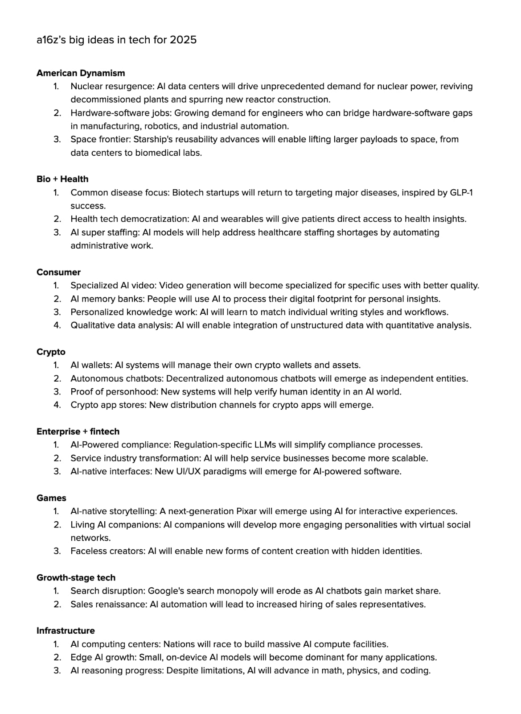

To create a feature where images are displayed as small thumbnails that expand when clicked, similar to Twitter or Reddit, you can achieve this with a combination of CSS for the styling and JavaScript for the interactive functionality. Here's an updated version of your code that includes this functionality:

### Changes:
1. **CSS**: The images will be shown as smaller thumbnails, and a larger version will be displayed when clicked.
2. **JavaScript**: Adds functionality to open the image in a larger view when the thumbnail is clicked.

### Updated Code:

```html
<!DOCTYPE html>
<html lang="en">
<head>
    <meta charset="UTF-8">
    <meta name="viewport" content="width=device-width, initial-scale=1.0">
    <title>Interesting Things</title>
    <style>
        /* Thumbnail images style */
        .responsive-img {
            max-width: 100px; /* Set smaller thumbnail size */
            height: auto;
            cursor: pointer; /* Indicate that the image is clickable */
            transition: transform 0.3s ease; /* Smooth zoom effect */
        }

        .responsive-img:hover {
            transform: scale(1.05); /* Slightly zoom image on hover */
        }

        /* Image gallery styling */
        .image-gallery {
            display: flex;
            gap: 10px;
            flex-wrap: wrap;
        }

        /* Lightbox modal styling */
        .lightbox {
            display: none; /* Hidden by default */
            position: fixed;
            top: 0;
            left: 0;
            width: 100%;
            height: 100%;
            background-color: rgba(0, 0, 0, 0.8);
            justify-content: center;
            align-items: center;
        }

        .lightbox img {
            max-width: 90%;
            max-height: 90%;
            margin: 20px;
        }

        .lightbox.open {
            display: flex; /* Show the lightbox when it's open */
        }

        .close-lightbox {
            position: absolute;
            top: 20px;
            right: 20px;
            color: white;
            font-size: 30px;
            cursor: pointer;
        }

    </style>
</head>
<body>
    <h1>Daily list of interesting things I come across.</h1>

    <section>
        <h2>Dec 11 2024</h2>
        <ul>
            <li>
                <p>source: <a href="https://news.ycombinator.com/item?id=35164819" target="_blank">news.ycombinator.com/item?id=35164819</a></p>
                <p>post from user 'pwim' on Hacker News:</p>
                
                <p>here's his site: <a href="https://www.tokyodev.com/" target="_blank">www.tokyodev.com</a></p>
            </li>
        </ul>
    </section>

    <section>
        <h2>Dec 10 2024</h2>
        <ul>
            <li>
                <p>source: <a href="https://x.com/cb_doge/status/1866565984502550905" target="_blank">x.com/cb_doge/status/1866565984502550905</a></p>
                <p>bullish on america:</p>
                
            </li>
        </ul>
    </section>

    <section>
        <h2>Dec 09 2024</h2>
        <ul>
            <li>
                <p>source: <a href="https://x.com/cb_doge/status/1866565984502550905" target="_blank">x.com/cb_doge/status/1866565984502550905</a></p>
                <p>bullish on america:</p>
                
            </li>

            <li>
                <p>Sources:
                    <a href="https://a16z.com/big-ideas-in-tech-2025/" target="_blank">a16z.com/big-ideas-in-tech-2025</a>,
                    <a href="https://www.ycombinator.com/rfs" target="_blank">www.ycombinator.com/rfs</a>,
                    <a href="https://x.com/levelsio/status/1865951611211628874" target="_blank">x.com/levelsio/status/1865951611211628874</a>,
                    <a href="https://x.com/levelsio/status/1865952213643772206" target="_blank">x.com/levelsio/status/1865952213643772206</a>
                </p>
                <div class="image-gallery">
                    
                    
                    
                </div>
            </li>
        </ul>
    </section>

    <!-- Lightbox Modal -->
    <div class="lightbox" id="lightbox">
        <span class="close-lightbox" onclick="closeLightbox()">×</span>
        
    </div>

    <script>
        // Function to open the lightbox and display the clicked image
        function openLightbox(img) {
            const lightbox = document.getElementById('lightbox');
            const lightboxImg = document.getElementById('lightbox-img');
            lightboxImg.src = img.src; // Set the image source to the clicked image
            lightbox.classList.add('open'); // Show the lightbox
        }

        // Function to close the lightbox
        function closeLightbox() {
            const lightbox = document.getElementById('lightbox');
            lightbox.classList.remove('open'); // Hide the lightbox
        }
    </script>
</body>
</html>
```

### Key Points:
1. **CSS**: 
   - The `.responsive-img` class makes the images initially small (100px width). You can adjust this value based on your preference.
   - The `:hover` effect slightly zooms the image to indicate it's clickable.
   
2. **JavaScript**:
   - When an image is clicked, the `openLightbox` function opens a modal and displays the larger version of the image.
   - The modal (`.lightbox`) has a close button (`×`), and clicking the close button or outside the modal will close it using the `closeLightbox` function.

3. **Lightbox Modal**:
   - The modal is hidden by default and shown only when an image is clicked, displaying the larger version of the image.

### Result:
When you click on any image, it will open in a larger view (in a modal), and you can close the modal by clicking the close button (`×`) or anywhere outside the modal.
